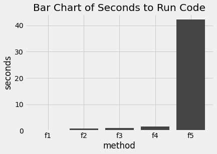

# Overview
Testing different methods of creating arrays by performance measured through elapsed time. The following are descriptions of various ways to create arrays
used for this test.

## f1

This is the numpy method using the provided function of creating arrays. While the performance is the most optimal it is often tricky to apply
this method to a real example.

## f2

While the previous example creates a numpy array this method uses native Python functions to create a list. After converting this list to an array
the variable can be used for scientific computing purposes.

## f3

This method investigates the factor of pre-allocation. If the variable is stored in memory first it is computationally faster to make changes to that
variable rather than continually appending.

## f4

The only difference between this method and f2 as mentioned earlier is the conversion to a numpy array. The elapsed time shows it is faster to pre-allocate
the array using numpy only than to create a Python list first and do a conversion.

## f5

The final method involves creating an array the intuitive way by concatenating or appending each iteration of a for loop to an array initialised to be empty. This method is so slow that the default scale of the plotting library is not capable of displaying how much faster the fastest method is compared to this one on the same scale.

